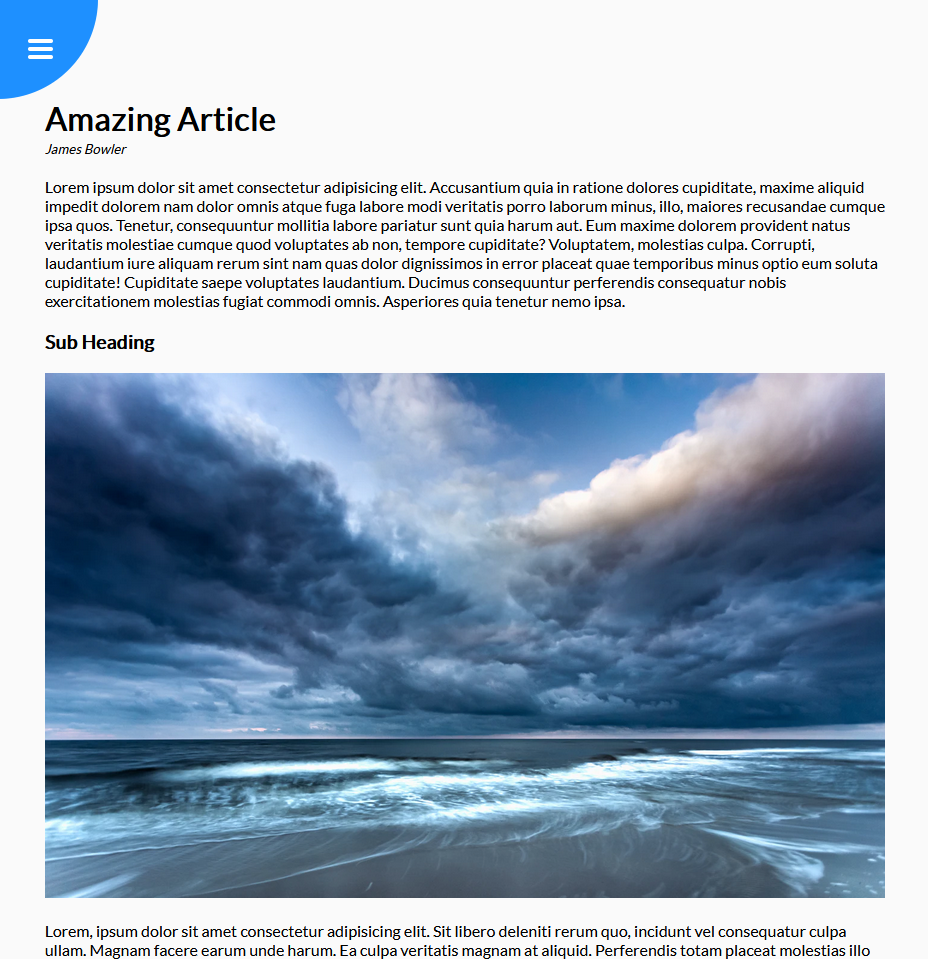
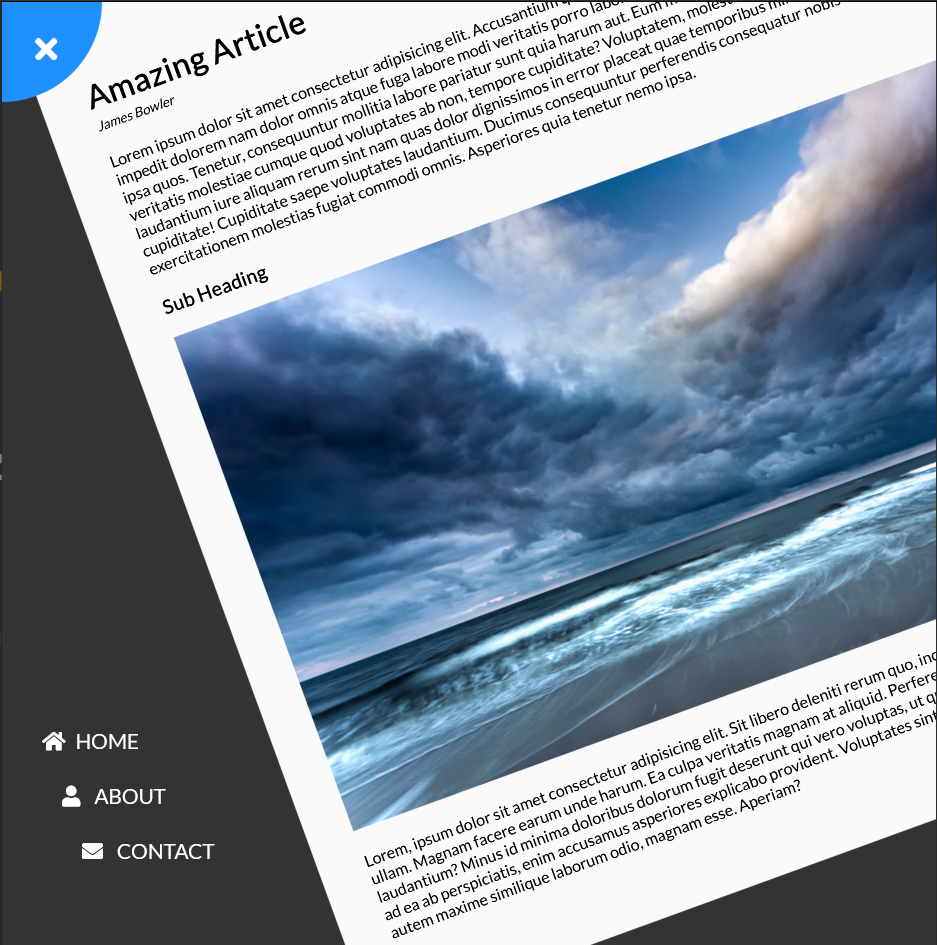

# Rotating Navigation

## Project 3 for 50 projects in 50 days.

This a HTML5 CSS3 & JavaScript project to display an example article which rotates on button click to reveal the navigation links..

### Screenshots

 

