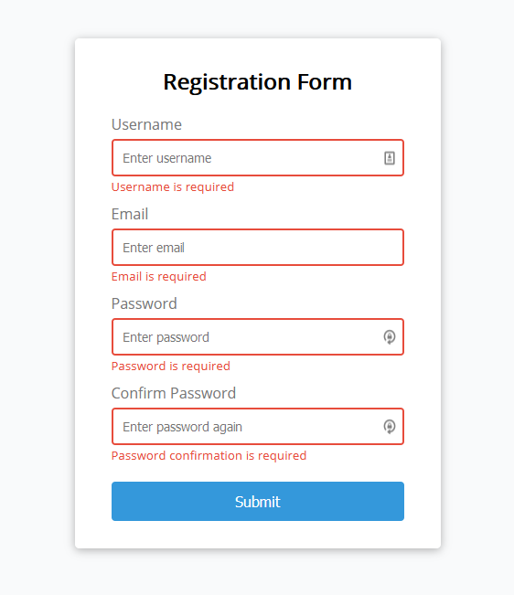
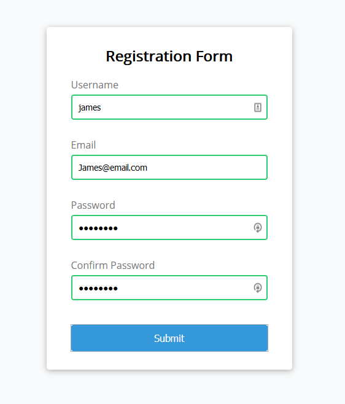

# Form Validation

## Project 7 for 50 projects in x days.

This a HTML5 CSS3 & JavaScript project to implement basic form validation.
The form checks for:

- empty values in required fields
- minimum & maximum length of input
- valid email
- matching passwords

### Screenshots

 

